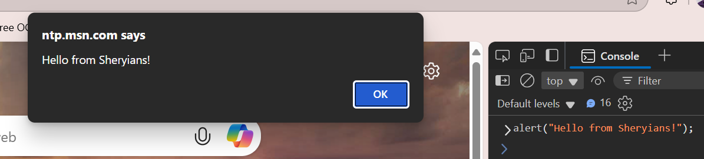
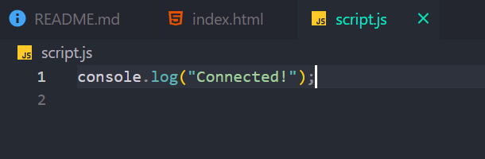
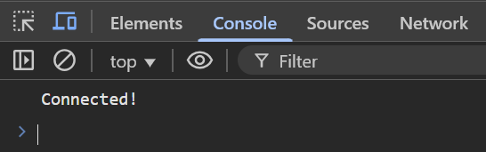

# Day 28 Data Types In JS

## JS Assignment 27-oct-2025

### Introduction to JS

Task 1. Open any website -> right-click -> Inspect -> Console -> type: `document.title`

- Opened [Awwwards](https://www.awwwards.com/)
- Inspect -> Console -> `document.title`
- Output > `Awwwards - Website Awards - Best Web Design Trends`

Task 2. Try: alert(“Hello from Sheryians!ˮ)

- Console -> `alert(“Hello from Sheryians!ˮ)`



Task 3. Write one line in your own words: “If HTML is skeleton, CSS is clothes — what
is JS?ˮ

- `If HTML is skeleton of webpage, CSS is styling of webpage, then JavaScript is what enables the functionality & Interactivity of webpage.`

Task 4. Write one example of where youʼve seen JS being used (like popup, animation, etc.)

- I have seen JavaScript in work in form validation.
- Website animations on Scroll.
- Increase level of game, when player Win the game.

### Linking JavaScript Files

Task 1. Create an HTML file and link JS file.

- `index.html` file code with added `script.js`

```html
<!DOCTYPE html>
<html lang="en">
  <head>
    <title>Linking JS</title>
  </head>
  <body>
    <!-- Any Content -->

    <script src="script.js"></script>
  </body>
</html>
```

Task 2. In script.js, write: console.log(“Connected!ˮ)





Task 3. Move the script tag to the section and see what happens.

- Nothing significant, if we move the `<script>` tag to `<head>` tag, or at starting of `<body>` tag then The javascript will load even before html get completely renderd, and because in JS we select many html element to change there properties, and they arent loaded yet, so javascript won't find them, and eventually will give `error`.
- So the best place to add `<script>` tag is just before closing ` </body>` tag

Task 4. Try using defer:

```html
<script defer src="script1.js"></script>
<script defer src="script2.js"></script>
```

- Used to tackle the early js loading issue. When this attribute added in script tag, the script get executed only after html DOM completely get loaded, and also the browser downloads both together in parralal. But execute html first then javascript.
- It makes page load faster.
- 'Element not found' error won't come.
- Scripts run in order from top to bottom. I.e. script1.js run first then script2.js

### Running JS in Browser Console

Task 1. Open console and type: 2 + 2

Task 2. Type: `alert("Hi")`

Task 3. Try: `prompt(“Your name?ˮ)`

Task 4. Type:

```js
let city = “Bhopalˮ;
city
```

**All Done 👍**

## typeof each data type

number, string, boolean, array, object, null, symbol

```js
let age = 25;
let stuName = "Anil";
let isStudent = true;
let skills = ["HTML", "CSS", "JS"];
let userDetails = {
  city: "Jodhpur",
  email: "xyz@gmail.com",
};
let level = null;
let yoyo;
let smbl = Symbol("id");
```

Output on console

```js
typeof age;
> "number"

typeof stuName;
> "string"

typeof isStudent;
> "boolean"

typeof skills;
> "object"

typeof userDetails;
> "object"

typeof level;
> "object"

typeof yoyo;
> "undefined"

typeof smbl;
> "symbol"

typeof NaN;
> "number"

```
So array, onject, and null show `object` typeof, and Nan shows `number` .


