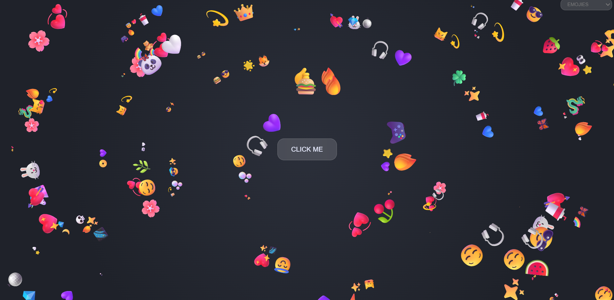
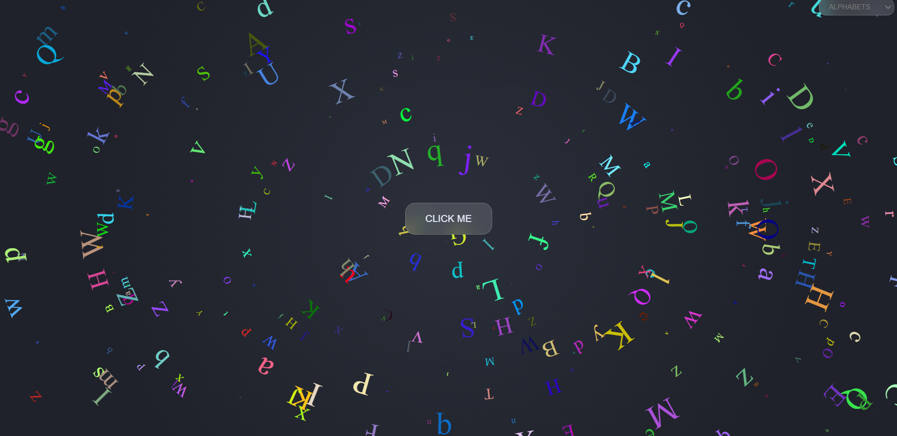
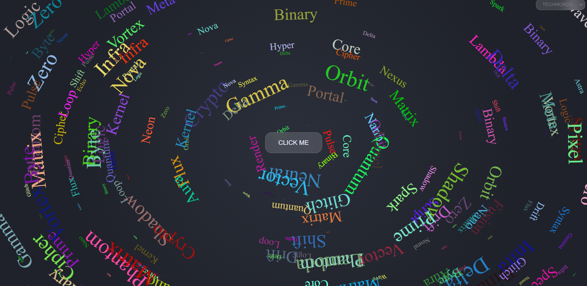
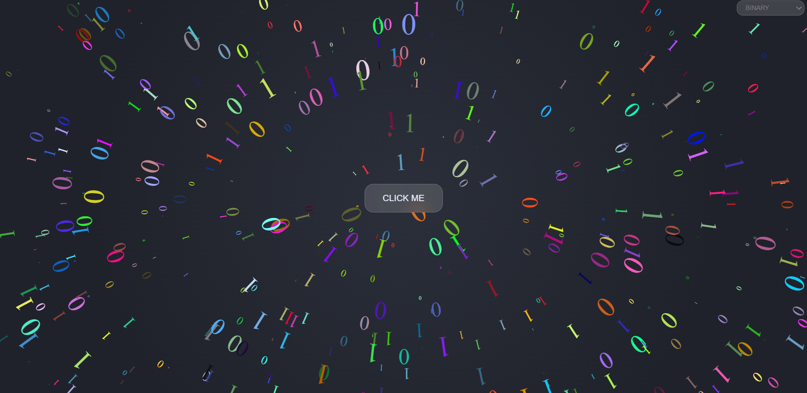
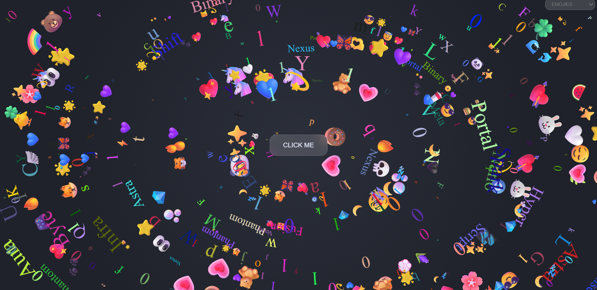

# 🌟 Emoji + TechWords + Alphabets Particle Blast

### A playful, chaotic, mathematically-driven particle explosion on the web!

---

## 🚀 Overview

This project is a **fun, mesmerizing particle generator** where a single button triggers a storm of floating elements - emojis, alphabets, binary digits, tech words, and more. Choose a category, click the button, and **your screen transforms into a living galaxy of spinning characters.**

- Click once -> spawn a burst
- Click & hold -> release unlimited chaos ⚡
- Switch categories -> create a mixed universe 🌌
- Refresh the page anytime for a blank canvas.

---

## ✨ Features

- 🎛️ **Theme Selector** - Choose one of:

  - Emojis
  - Alphabets
  - Binary digits
  - Tech words

- 🌀 **Dynamic Particle Rotation (Special Feature!)** Each spawned element **automatically aligns itself perpendicular** to an imaginary line from the center of the screen - giving everything a **perfect circular orbit effect**.
- 🚀 **Click-to-Button** - Generate random elements with unique positions & animations.
- ⚡ **Click & Hold Turbo Mode** - Add hundreds of elements per second.
- 🎨 **Mix All Types** - Switch categories anytime to combine visual styles.
- 🔄 **Instant Reset** - Refresh the page to clear the screen.
- 🛠️ **Powered By**

  - JavaScript `createElement()`
  - DOM manipulation
  - Mathematical angle calculations

---

## 🧠 Mathematical Rotation Algorithm (The Magic Behind the Visuals)

One of the most beautiful parts of this project is the **math-based orientation system**.

When a particle is created:

1. Its **random (x, y)** position relative to the top left of the screen is calculated.
2. Then x and y are removed from 50 to get coordinates from center of screen.
3. The angle θ between the center and that element is determined using:

   ```
   θ = Math.atan(50 - y, x - 50)
   ```

4. The element is then **rotated so that it becomes perpendicular** to the center-to-element line.

   - This makes every element perfectly tangent to an imaginary circular path around the center.

5. As a result, every particle looks like it is flowing in a **swirling spiral formation** - no matter where it appears.

This gives the project its unique **circular, vortex-like visual effect** that feels natural, dynamic, and extremely satisfying to watch.

---

## 🖼️ Gallery

(Replace these with your actual screenshots)

### 1️⃣ Emoji Explosion



### 2️⃣ Alphabet Storm



### 3️⃣ TechWords Chaos Mode



### 4️⃣ Binary Mode



### 5️⃣ Mixed Mode (All Types Together)



---

## 🧩 How It Works

1. Pick a **content type** from the dropdown.
2. Click the **central button**.
3. Elements appear at random positions & instantly rotate based on their angle from the center.
4. Hold the button to spawn a massive stream of elements.
5. Change the selection any time to mix emojis, text, binary, and more.
6. Refresh the page to reset the canvas.

Behind the scenes:

- Random element is created
- Position is randomized
- Angle from center is computed
- Particle is rotated mathematically
- CSS animations give it motion
- DOM keeps adding elements until you stop holding the button

---

## 💡 Future Enhancements

- Add themes (neon, pastel, galaxy, glitch)

---

## 🎉 Final Thoughts

This project isn’t just a particle generator - it’s a **mathematically beautiful visual playground** where emojis, binary digits, and alphabets dance in perfect circular harmony.

Perfect for exploring:

- DOM creation
- Event handling
- Animation logic
- Geometric math in UI
- Interactive fun

Thank You 💖
