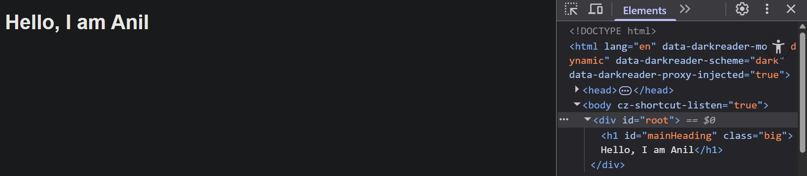

# Class 68 React Folder Structure

## Creating basic element using React

### index.html

```html
<!DOCTYPE html>
<html lang="en">
  <head>
    <meta charset="UTF-8" />
    <meta name="viewport" content="width=device-width, initial-scale=1.0" />
    <title>basic</title>
  </head>
  <body>
    <div id="root"></div>

    <script crossorigin src="https://unpkg.com/react@18/umd/react.development.js"></script>
    <script crossorigin src="https://unpkg.com/react-dom@18/umd/react-dom.development.js"></script>
    <script type="module" src="./script.js"></script>
  </body>
</html>
```

### main.js

```js
let h1 = React.createElement('h1', { id: 'mainHeading', className: 'big' }, 'Hello, I am Anil');

let root = ReactDOM.createRoot(document.getElementById('root'));
root.render(h1);
```

Output 

## React folder structure using Vite bundler

- Step 1 : Install Node.js
- Step 2 : Open folder
- Step 3 : Open terminal in VS Code (ctrl + `)
- Step 4 : $npm create vite OR $npm create vite@latest
- Step 5 : give project name (eg. class68), choose framework : React, choose Variant : Javascript
- Step 6 : $cd projectName ==> $cd class68
- step 7 : $npm install
- step 8 : $npm run dev

---

### file main.jsx

- .js file => basic javascript file
- .jsx file => extensible javscript file. (JS + HTML), we can write HTML code in javascript

## Creating elements using jsx files

### file App.jsx

```jsx
function App() {
  return (
    <div>
      <h1>Hello i am h1</h1>
      <h2>Hello i am h2</h2>
    </div>
  );
}

export default App;
```

### file main.jsx

```jsx
import { createRoot } from 'react-dom/client';

//to import css
import './index.css';

// to import app function that returns component
import App from './App.jsx';
let root = createRoot(document.getElementById('root'));

root.render(<App />);
// OR root.render(App())
```

### for exporting multiple elements directly into parent, use <></> empty tag

```jsx
function App() {
  return (
    <>
      <h1>Hello i am h1</h1>
      <h2>Hello i am h2</h2>
    </>
  );
}

export default App;
```

## extensions

- simple react snippets
- es7 react/redux/graph...... etc snippet
- es7+ react reduc ...... etc snippet
- js/jsx snippet

### diff in public vs src/assets folder

- public : used to store normal files,
- src/assets : used to store important files
